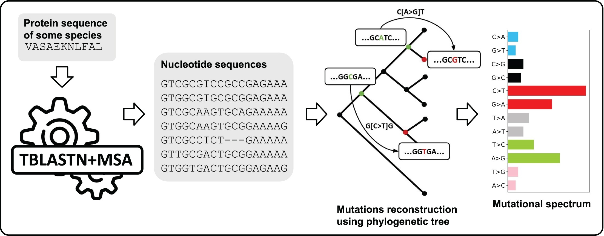

# NeMu-pipeline

A Nextflow-based bioinformatics pipeline for mutational spectra reconstruction from sequence data using phylogenetic methods.

<!-- example repo - https://github.com/cbcrg/unistrap/tree/master -->

## Workflow schematic representation



## Features

- Automatic sequence retrieval using tblastn and a nucleotide database (for protein input).
- Outlier sequence removal.
- Mutation polarization using outgroup-based phylogenetic tree rooting.
- Mutation probability accounting based on ancestral state probabilities.
- Mutation sampling along the tree for variance estimation.
- Spectra derivation for synonymous and fourfold synonymous (`syn4f`) sites.
- Optional spectra derivation by site rate category.

## Dependencies

Dependencies are specified in `environment.yml` and include:

- Nextflow (with Java)
- BLAST+
- MAFFT and MACSE
- SeqKit and TaxonKit
- IQ-TREE2
- TreeShrink
- Python with `pymutspec`

## Installation

### Conda

```bash
git clone https://github.com/mitoclub/nemu-pipeline-nf.git
cd nemu-pipeline-nf

conda env create -f environment.yml -n nemu --yes
# or: mamba env create -f environment.yml -n nemu --yes

conda activate nemu
```

### Docker

Recommendations for comparative-species analysis: `--branchSpectra`, `--model`, `--outgroupId`, `--consCatCutoff`.

```bash
docker build -t nemu-pipeline:latest .
#docker run -it nemu-pipeline:latest nextflow run /app/main.nf ...
```

## Usage

### Nucleotide multi-FASTA input

Input fasta should have outgroup record with ID `OUTGRP` (or specified by `--outgroupId`). See [K10000.fasta](./test_data/ecoli_nucl_seqs/K10000.fasta) for example.

```bash
nextflow run main.nf \
  -output-dir results_ecoli \
  --inputType nucleotide_coding \
  --input "test_data/ecoli_nucl_seqs/*.fasta" \
  --outgroupId OUTGRP
```

### Protein FASTA input

Input fasta should have species names or taxon IDs in headers. For example:
`>Some_ID [9606]` or `>Some_ID [Homo sapiens]`

See [test_proteins.fasta](./test_data/test_proteins_mtdna.fasta) for example.

```bash
nextflow run main.nf \
  -output-dir results_test \
  --inputType protein \
  --input "test_data/test_proteins.fasta" \
  --gencode 2 \
  --db path_to_nucleotide_blast_db_prefix \
  --taxdump "$HOME/.taxonkit"
```

## Command Line Options

`main.nf` parameters use camelCase names:

- `--input` Input FASTA path or glob pattern.
- `--inputType` `protein`, `nucleotide_coding`, or `nucleotide_noncoding`.
- `--gencode` Genetic code table (default `1`).
- `--outgroupId` Outgroup sequence ID for nucleotide input (default `OUTGRP`).
- `--aligned` Whether nucleotide input is pre-aligned (default `false`).
- `--db` BLAST database prefix (protein input).
- `--taxdump` TaxonKit taxdump directory (protein input).
- `--speciesName` Override species name for protein input.
- `--maxTargetSeqs` Maximum BLAST targets (default `2000`).
- `--threads` Threads per input (default `1`).
- `--msa-mode` `auto`, `macse`, `mafft_macse`, or `mafft`.
- `--minSeqs` Minimum sequence count to continue (default `4`).
- `--minMuts` Minimum reconstructed mutations to derive a spectrum (default `5`).
- `--treefile` User-provided tree file path.
- `--model` IQ-TREE model for tree inference.
- `--modelAsr` IQ-TREE model for ASR.
- `--runTreeShrink` Enable TreeShrink pruning (default `true`).
- `--consCatCutoff` Conservation category cutoff.
- `--probaArg` Use probabilistic mutation extraction (default `true`).
- `--uncertaintyCoef` Use phylogeny uncertainty coefficient (default `true`).
- `--plot` Generate spectra plots.
- `--internal` Derive spectra for internal branches.
- `--terminal` Derive spectra for terminal branches.
- `--branchSpectra` Derive branch-level spectra.
- `--help` Print help and exit.

Useful Nextflow CLI options:

- `-o, -output-dir DIR`
- `-resume`
- `-with-report`
- `-with-trace`
- `-with-timeline`

## Advanced Usage

Recommendation for comparative-species analysis: use `--branchSpectra`, `--model`, `--outgroupId`, and `--consCatCutoff` as needed.

## TODO

- [ ] Add parsing of taxon IDs from FASTA headers (configurable option)
- [ ] Add comprehensive tests for pipeline (Nextflow-based test files)
- [ ] Run and validate tests
- [ ] Finalize pipeline configuration
- [ ] Prepare and optimize container image

<!-- 
## Testing

Run the test script from the repository directory to validate the pipeline:

```bash
bash test.sh
```
 -->
